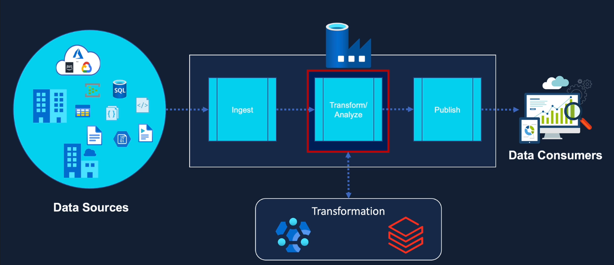
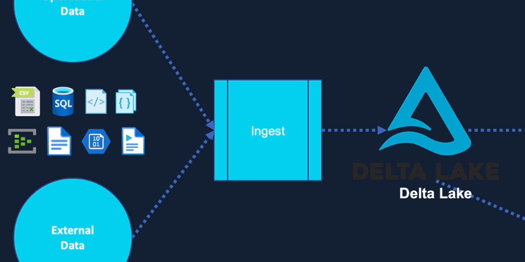
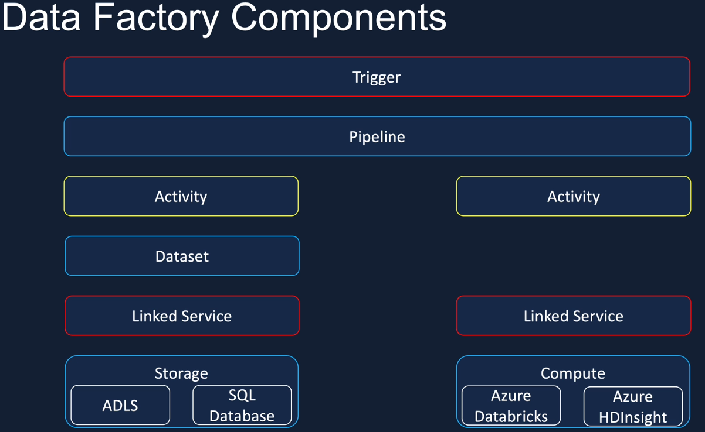
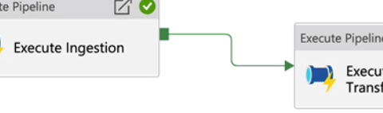
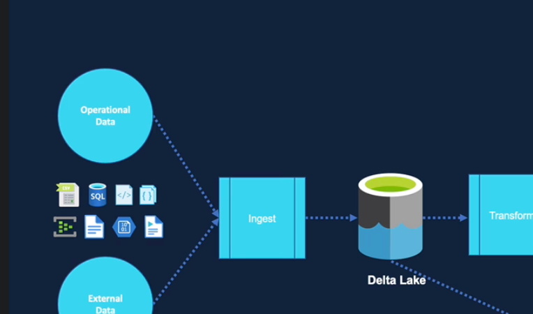
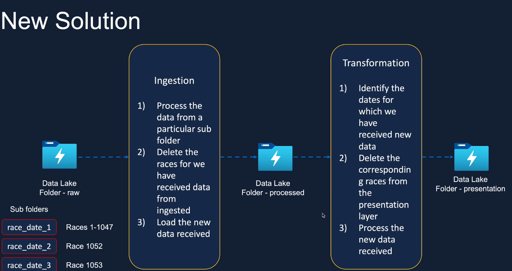

# Advanced ETL using Azure + Databricks + Pyspark

**Author:** [Divyansh Kushwaha](https://github.com/DivyanshKushwaha)  
**Repository:** [https://github.com/DivyanshKushwaha/etl-databricks-pyspark](https://github.com/DivyanshKushwaha/etl-databricks-pyspark)  
**Last updated:** 30 June 2026

## Introduction
This project aims to perform data transformation using Databricks `Pyspark` and `SparkSQL`. The data was mounted from an `Azure Data Lake Storage Gen2` and transformed within Databricks. The transformed data was then loaded back to the Datalake. This notebooks were then combined using `Azure Data Fractory`
#### Data Flow project overview

#### Lakehouse project overview


## Tools & Libraries
* Databricks Pyspark
* Python
* SparkSQL
* Azure Data Lake Storage Gen2
* Azure Storage Account
* Azure resource group
* Azure Key Vault
* Azure Data Factory
* PowerBI
* Azure Storage Explorer

## Steps
1. Mount the data from the Azure Data Lake Storage Gen2 to Databricks.
2. Use Pyspark within Databricks to perform data transformations using `DELTA TABLES`.
3. Load the transformed data back to the Azure Data Lake Storage Gen2.

## Data
The data can be found in the data folder. There is either the `raw` data or the `raw_incremental_load` data. 
This is basically the same data, but the in `raw_incremental_load` the data is ordered in a way to mimic data, which would normally generated over time and hence use incremental load. 

## Prerequisites
* An active Azure subscription with access to Azure Data Lake Storage Gen2
* Databricks account set up
* Python
* Pyspark
* SQL
* Azure Storage Explorer installed

## Conclusion
This project demonstrates how to perform data transformation using Databricks Pyspark and Azure Data Lake Storage Gen2. This setup can be used for larger scale data processing and storage needs.

## Mount data from ADLS Gen2 to Databricks
- Storing data in the FileStore of Databricks, loading into Workspace notebook and perfroming data science.
- Storing Data in Azure Blob and mounting to Databricks. This includes the following steps:
1. Create Resource Group in Azure.
2. Create Storage account and assign to Resouce group.
3. App registration (create a managed itenditiy), which we will use to connect Databricks to storage account.
3.1 Create a client secret and copy.
4. Create Key vault (assign to same resource group)
4.1. Add the cleint secret here.
5. Create secret scope within Databricks.
5.1 Use the keyvault DNS (url) and the ResourceID to allow Databricks to access the key valuts secrets within a specific scope.
6. Use this scope to retreive secrets and connect to storage acount container, where data is stored in Azure:

```
configs = {"fs.azure.account.auth.type": "OAuth",
       "fs.azure.account.oauth.provider.type": "org.apache.hadoop.fs.azurebfs.oauth2.ClientCredsTokenProvider",
       "fs.azure.account.oauth2.client.id": "<appId>",
       "fs.azure.account.oauth2.client.secret": "<clientSecret>",
       "fs.azure.account.oauth2.client.endpoint": "https://login.microsoftonline.com/<tenant>/oauth2/token",
       "fs.azure.createRemoteFileSystemDuringInitialization": "true"}
```

7. Finally we can mount the data:
```
dbutils.fs.mount(
source = "abfss://<container-name>@<storage-account-name>.dfs.core.windows.net/folder1",
mount_point = "/mnt/Files/formula1/raw",
extra_configs = configs)
```
8. Now we can load the data from the MountPoint into a Dataframe and perform actions.


## How to mount data from Azure Data Lake Storage Gen2 to Databricks.  

### Used Azure Services


### Azure Data Factory 
We can either connect the databricks instance to the DataFactory instance through AD or though a personalised acces token, which we can generate in Databricks and pass as an authentication method. 




### Potential project architecture (Big picture)


### Incremetal load architecture


### Databricks Architecture

